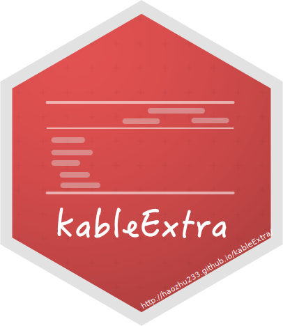

说起来这包写了都一年了我还没写过中文文档，现在给大家补上。

另外这中文版我就不发CRAN了，要看的麻烦移步这包的文档网站[http://haozhu233.github.io/kableExtra/](http://haozhu233.github.io/kableExtra/)。

（因为我基本是在~~自由发挥~~重写一遍。。你们不要太去在意中文英文的不同哈。。。）


# 简介
`kableExtra`的目标是帮你搭建以及美化一些常用而又较为复杂的表格。这些表格有个特点，那就是用word 或者excel来做会极其简单，而要用一个编程语言去描述，尤其是对于一些LaTeX初心者（比如当年的我。。），往往会让人绝望。而现在，在这个包的帮助下，我希望你能用一种更为直觉的方式来创建你的表格，把更多的时间花在内容上。而那些排版之类的事情，就留给这个包吧。：）

# 安装
CRAN安装`install.packages("kableExtra")`不用我说，想尝鲜可以使用开发版。
```r
# install.packages("devtools")
devtools::install_github("haozhu233/kableExtra")
```

# 第一步 
## 用`kable`生成HTML表格
首先要强调一下，`kable`这个function来自于R圈大佬谢益辉的`knitr`包。大致上说，`kable`可以生成三种格式的表格：`HTML`, `LaTeX` 和 `markdown`（默认）。`markdown`作为默认的格式完美契合`rmarkdown`本身，可却因为`markdown`表格本身功能上的限制，在很多情况下达不到我们的要求。因此，当你需要个性化你的表格时，你往往需要先让`kable`先帮你生成一个`HTML`的表格。在这份文档中，我们主要使用`mtcars`这个数据的前几列和几行数据来演示。

```{r}
library(kableExtra)
dt <- mtcars[1:5, 1:6]

kable(dt, "html")
```

注意，如果你有好几个表格要去生成，与其在每一个kable里定义格式，不如在所有的事情开始之前定义一个全局的设置。这样的话，上面的语句就只需要打`kable(dt)`就可以了。

```{r}
options(knitr.table.format = "html") 
```

当然，在今后的版本中（目前开发版），甚至这一步都可以被省略。今后，`kableExtra`将会自动根据你需要的情况帮你设好这个全局格式。这一步发生在你加载这个包的时候（`library(kableExtra)`），所以如果你不想要这个功能的话，可以在你加载`kableExtra`之前通过设置`options(kableExtra.auto_format = F)`来解决。

## bootstrap了解一下
如果你从没听过bootstrap的话，你应该去了解一下。简单来说，bootstrap是个开源的CSS库，可以用来很方便地美化HTML页面。也因此，bootstrap在RStudio的产品中被大量使用。你用rmarkdown和shiny生成出来的HTML文档和app都有加载。而这个包的HTML部分也提供了一些接口方便你快速实现一些bootstrap风的表格。

```{r}
dt %>%
  kable("html") %>%
  kable_styling()
```

# 表格整体风格
`kable_styling`提供了几种其他的方式来定制表格的整体风格。

## Bootstrap的表格格式
如果你熟悉bootstrap，那么以下这些CSS类对你一定不陌生：`striped`, `bordered`, `hover`, `condensed` 以及 `responsive`. 不熟悉也没关系，你可以看看 [这里](http://getbootstrap.com/css/#tables)来了解。你可以通过`kable_styling`快速地把这些样式应用到你的表格里。比如，下面这个例子就是给表格加上斑马纹和悬浮效果。

```{r}
kable(dt, "html") %>%
  kable_styling(bootstrap_options = c("striped", "hover"))
```

有些人觉得默认的bootstrap表格每行都太高了，这时候用上`condensed`会让内容显得更紧凑。
```{r}
kable(dt, "html") %>%
  kable_styling(bootstrap_options = c("striped", "hover", "condensed"))
```

`responsive`这选项可以让表格样式随屏幕宽度变化，更适合手机屏。
```{r}
kable(dt, "html") %>%
  kable_styling(bootstrap_options = c("striped", "hover", "condensed", "responsive"))
```

## “为啥我的表格这么宽啊？”
“为啥我的表格这么宽”是一个`rmarkdown`新人常见问题。这其中的原因是，`bootstrap`把表格的宽度统一订成了100%的[容器](http://w3schools.wang/w3css/w3css_containers.html)宽。设计`bootstrap`的人原来想让你用他们的grid system来控制表格的宽度，可是当你在写`rmarkdown`的时候，难不成还想即兴来定义一串`<div>`？解决办法如下。
```{r}
kable(dt, "html") %>%
  kable_styling(bootstrap_options = "striped", full_width = F)
```

## 表格位置
表格在页面中位置也是排版很重要的一块。注意，这只有在表格不是全屏宽的时候才有用（这是当然的啦。
```{r}
kable(dt, "html") %>%
  kable_styling(bootstrap_options = "striped", full_width = F, position = "left")
```

除了常见的左中右，你还可以选择`float_left`和`float_right`。
```{r}
kable(dt, "html") %>%
  kable_styling(bootstrap_options = "striped", full_width = F, position = "float_right")
```
滚滚长江东逝水，浪花淘尽英雄。是非成败转头空。青山依旧在，几度夕阳红。白发渔樵江渚上，惯看秋月春风。 一壶浊酒喜相逢。 古今多少事，都付笑谈中。滚滚长江东逝水，浪花淘尽英雄。是非成败转头空。青山依旧在，几度夕阳红。白发渔樵江渚上，惯看秋月春风。 一壶浊酒喜相逢。古今多少事，都付笑谈中。滚滚长江东逝水，浪花淘尽英雄。是非成败转头空。青山依旧在，几度夕阳红。白发渔樵江渚上，惯看秋月春风。 一壶浊酒喜相逢。古今多少事，都付笑谈中。滚滚长江东逝水，浪花淘尽英雄。是非成败转头空。青山依旧在，几度夕阳红。白发渔樵江渚上，惯看秋月春风。一壶浊酒喜相逢。古今多少事，都付笑谈中。滚滚长江东逝水，浪花淘尽英雄。是非成败转头空。青山依旧在，几度夕阳红。白发渔樵江渚上，惯看秋月春风。一壶浊酒喜相逢。古今多少事，都付笑谈中。滚滚长江东逝水，浪花淘尽英雄。是非成败转头空。青山依旧在，几度夕阳红。白发渔樵江渚上，惯看秋月春风。 一壶浊酒喜相逢。古今多少事，都付笑谈中。滚滚长江东逝水，浪花淘尽英雄。是非成败转头空。青山依旧在，几度夕阳红。白发渔樵江渚上，惯看秋月春风。 一壶浊酒喜相逢。 古今多少事，都付笑谈中。


## 字体大小
如题，当你的表格过大时，你可以调调字体大小。
```{r}
kable(dt, "html") %>%
  kable_styling(bootstrap_options = "striped", font_size = 7)
```

# 列与行的格式
## 列
`column_spec`如其名，可以帮你定义某一列或者几列的样式，比如宽度，字体颜色，加粗，斜体等。列的宽度其实尤为重要，这样如果你的表格里有一串巨长的文字，它的格式不会一下被打乱。

```{r}
text_tbl <- data.frame(
  Items = c("Item 1", "Item 2", "Item 3"),
  Features = c(
    "Lorem ipsum dolor sit amet, consectetur adipiscing elit. Proin vehicula tempor ex. Morbi malesuada sagittis turpis, at venenatis nisl luctus a. ",
    "In eu urna at magna luctus rhoncus quis in nisl. Fusce in velit varius, posuere risus et, cursus augue. Duis eleifend aliquam ante, a aliquet ex tincidunt in. ", 
    "Vivamus venenatis egestas eros ut tempus. Vivamus id est nisi. Aliquam molestie erat et sollicitudin venenatis. In ac lacus at velit scelerisque mattis. "
  )
)

kable(text_tbl, "html") %>%
  kable_styling(full_width = F) %>%
  column_spec(1, bold = T, border_right = T) %>%
  column_spec(2, width = "30em", background = "yellow")
```


## 行
`row_spec`和`column_spec`差不多，除了没有列宽。注意，当你数第几行的时候，你不需要考虑表头和你通过`pack_rows`添加的那些行，就数那些原生的“内容”行就行。

```{r}
kable(dt, "html") %>%
  kable_styling("striped", full_width = F) %>%
  column_spec(5:7, bold = T) %>%
  row_spec(3:5, bold = T, color = "white", background = "#D7261E")
```

### 表头的那行
只需要说`row_spec(0, ...)`就可以了。
```{r}
kable(dt, format = "html") %>%
  kable_styling("striped", full_width = F) %>%
  row_spec(0, angle = -45)
```

# 格子的格式
`cell_spec` 和之前说的两个`spec`不一样，你应该在把你的数据放进`kable`之前使用它，就像接下来的例子。你可以很容易地在`dplyr`的pipeline里加上一截`cell_spec`。注意，因为你用`cell_spec`生成的是直接的`HTML`和`LaTeX`，你需要在`kable`里加上`escape = FALSE`。同时，你需要告诉`cell_spec`你到底需要`HTML`还是`LaTeX`。而在今后版本的`kableExtra`里，因为全局的表格格式已经被自动设好了，你就不需要做这一步了。

## `cell_spec`和`ifelse`
`cell_spec`和`ifelse`结合会让表格里的数据的可视度一下子高很多。
```{r, message=FALSE, warning=FALSE}
library(dplyr)
mtcars[1:10, 1:2] %>%
  mutate(
    # You don't need format = "html" if you have ever defined options(knitr.table.format)
    mpg = cell_spec(mpg, "html", color = ifelse(mpg > 20, "red", "blue")),
    cyl = cell_spec(cyl, "html", color = "white", align = "c", angle = 45, 
                    background = factor(cyl, c(4, 6, 8), 
                                        c("#666666", "#999999", "#BBBBBB")))
  ) %>%
  select(mpg, cyl) %>%
  kable("html", escape = F) %>%
  kable_styling("striped", full_width = F)
```

## 给你的表格加上Viridis Color
这包还带了几个`cell_spec`的辅助型方程，包括 `spec_color`, `spec_font_size` 和 `spec_angle`. 他们可以帮你把数据变成相应的颜色，字体大小和角度。其中最有意思的是那个颜色，这里用了[viridis color](https://CRAN.R-project.org/package=viridisLite)这个色板. 合理使用的话几乎可以用表格做出类似热图的可视化。

```{r}
iris[1:10, ] %>%
  mutate_if(is.numeric, function(x) {
    cell_spec(x, "html", bold = T, 
              color = spec_color(x, end = 0.9),
              font_size = spec_font_size(x))
  }) %>%
  mutate(Species = cell_spec(
    Species, "html", color = "white", bold = T,
    background = spec_color(1:10, end = 0.9, option = "A", direction = -1)
  )) %>%
  kable("html", escape = F, align = "c") %>%
  kable_styling("striped", full_width = F)
```


## 普通文本的格式
其实你也可以用`cell_spec`或者`text_spec`去定义普通文字的样式。 

```{r}
sometext <- strsplit("人群中突然钻出一个光头", "")[[1]]
text_formatted <- paste(
  text_spec(sometext, "html", color = spec_color(1:length(sometext), end = 0.9),
            font_size = spec_font_size(1:length(sometext), begin = 5, end = 20)),
  collapse = "")

```
`r text_formatted`

## Tooltip 悬浮提示框
你可以通过`cell_spec`相对简单地添加悬浮提示框. 举个例子，`text_spec("tooltip", color = "red", tooltip = "Hello World")` 会生成 `r text_spec("Hover over me", color = "red", tooltip = "Hello World")`。注意HTML原生的提示框非常慢，你可能会想用`bootstrap`的javascript版的。如果你想这么做的话，你需要把接下来的这段代码放在你的rmarkdown文本的任何地方。需要注意的是，如果你和这个文档一样使用了这种目录在侧面的格式，你就没办法使用这个功能。原因在于这个和`jqueryui`的`tooltip`互相冲突。这种情况下，你可能会想试试我下面说的`popover`。这两个差不多。

```
<script>
$(document).ready(function(){
$('[data-toggle="tooltip"]').tooltip(); 
});
</script>
```

## Popover Message 有头的悬浮弹出提示框
和之前一样的设定，区别在于你可以给`popover`的小框加一个标题。不加的话，和上面的功能基本一样。

```
<script>
$(document).ready(function(){
$('[data-toggle="popover"]').popover(); 
});
</script>
```

<script>
$(document).ready(function(){
$('[data-toggle="popover"]').popover(); 
});
</script>

```{r}
popover_dt <- data.frame(
  position = c("top", "bottom", "right", "left"),
  stringsAsFactors = FALSE
)
popover_dt$`Hover over these items` <- cell_spec(
  paste("Message on", popover_dt$position), # Cell texts
  popover = spec_popover(
    content = popover_dt$position,
    title = NULL,                           # title will add a Title Panel on top
    position = popover_dt$position
  ))
kable(popover_dt, "html", escape = FALSE) %>%
  kable_styling("striped", full_width = FALSE)
```

## 链接
你可以给文字添加一个链接`text_spec("Google", link = "https://google.com")`: `r text_spec("Google", link = "https://google.com")`。这里有一个利用加链接让`popover`悬浮框本来的文本更加明显的小技巧 `text_spec("Hover on me", link = "javascript:void(0)", popover = "Hello")`: `r text_spec("Hover on me", link = "javascript:void(0)", popover = "Hello")`

## 同时使用`kableExtra`和`formattable` 
如果你也喜欢[`formattable`](https://github.com/renkun-ken/formattable)的话，你其实可以将`formattable`和`kableExtra`用在一起，灰常酷炫。
```{r, message = FALSE, warning=FALSE}
library(formattable)
mtcars[1:5, 1:4] %>%
  mutate(
    mpg = color_tile("white", "orange")(mpg),
    cyl = cell_spec(cyl, "html", angle = (1:5)*60, 
                    background = "red", color = "white", align = "center"),
    disp = ifelse(disp > 200,
                  cell_spec(disp, "html", color = "red", bold = T),
                  cell_spec(disp, "html", color = "green", italic = T)),
    hp = color_bar("lightgreen")(hp)
  ) %>%
  kable("html", escape = F) %>%
  kable_styling("hover", full_width = F) %>%
  column_spec(5, width = "3cm") %>%
  add_header_above(c(" ", "Hello" = 2, "World" = 2))
```


# 行组和列组
## 列组
我们在Word里做表格时，要想表示两个列同属一个分类，我们会在这两列的上面再加一行，画条横线，写上名字。基本上`add_header_above`就是被设计来做这事的。在使用这个方程时，你需要给他一个**`named vector`**（划重点）。这个`named vector`的本身数值是所有列的 span值，而具体的文字则在names里（没看懂我在说啥的，请参考下面的例子）。
```{r}
kable(dt, "html") %>%
  kable_styling("striped") %>%
  add_header_above(c(" " = 1, "Group 1" = 2, "Group 2" = 2, "Group 3" = 2))
```

事实上，你甚至可以一层一层继续往上加下去。
```{r}
kable(dt, "html") %>%
  kable_styling(c("striped", "bordered")) %>%
  add_header_above(c(" ", "Group 1" = 2, "Group 2" = 2, "Group 3" = 2)) %>%
  add_header_above(c(" ", "Group 4" = 4, "Group 5" = 2)) %>%
  add_header_above(c(" ", "Group 6" = 6))
```

## 行组
我们一般做表格时，想表示几行同属一类一般有两种方式，其一是新插入一行大类的名称，然后再给那几行小的加上缩进。其二是在左边再加上一列，通过合并相印的行来表示所属的意思。相对应的，在`kableExtra`里，第一种方法可以用`pack_rows`实现，而第二种则可以用`collapse_row`。

### `pack_rows`
我们先说`pack_rows`，请看下面这个例子。

```{r}
kable(mtcars[1:10, 1:6], "html", caption = "Group Rows") %>%
  kable_styling("striped", full_width = F) %>%
  pack_rows("Group 1", 4, 7) %>%
  pack_rows("Group 2", 8, 10)
```

另一种使用`pack_rows`的方法是提供一个目录，用法和`add_header_above`相同。
```{r, eval = F}
# Not evaluated. This example generates the same table as above.
kable(mtcars[1:10, 1:6], "html", caption = "Group Rows") %>%
  kable_styling("striped", full_width = F) %>%
  pack_rows(index = c(" " = 3, "Group 1" = 4, "Group 2" = 3))
```

如果你熟悉CSS，你可以自己定义标签行的样式。

```{r}
kable(dt, "html") %>%
  kable_styling("striped", full_width = F) %>%
  pack_rows("Group 1", 3, 5, label_row_css = "background: repeating-linear-gradient(45deg, #d9230f, #d9230f 10px, #f96352 10px, #f96352 20px); color: #fff;")
```

说起来，`pack_rows`本来叫`group_rows`，可是`dplyr`0.8加了个同名的function，所以起了个小名，这样大家用起来方便些。

（白学现场：明明都是我先来的）

### 行的缩进
有时候只添加缩进就可以变的很有用，这时候你需要`add_indent`。
```{r}
kable(dt, "html") %>%
  kable_styling("striped", full_width = F) %>%
  add_indent(c(1, 3, 5))
```

### 合并行
`collapse_rows` 做的就是我们之前说的第二种在表格内表示所属关系的方法。请看下面的例子，第一二两列所有重复的内容都被自动合并了。

```{r}
collapse_rows_dt <- data.frame(C1 = c(rep("a", 10), rep("b", 5)),
                               C2 = c(rep("c", 7), rep("d", 3), rep("c", 2), rep("d", 3)),
                               C3 = 1:15,
                               C4 = sample(c(0,1), 15, replace = TRUE))
kable(collapse_rows_dt, "html", align = "c") %>%
  kable_styling(full_width = F) %>%
  column_spec(1, bold = T) %>%
  collapse_rows(columns = 1:2)
```

# 表格注脚

给表格添加注脚也是一个很常见的操作。在`kableExtra`里对应的是`footnote`方程。在这里，你可以使用四套编号体系：无编号`general`，数字`number`，字母`alphabet`和特殊符号`symbol`。注意，特殊符号我只定义了20个，因为一般你给表格加的注脚也不会有那么多。正如下面这个例子，你可以选择只用其中一种或者同时使用几种。

```{r}
kable(dt, "html", align = "c") %>%
  kable_styling(full_width = F) %>%
  footnote(general = "Here is a general comments of the table. ",
           number = c("Footnote 1; ", "Footnote 2; "),
           alphabet = c("Footnote A; ", "Footnote B; "),
           symbol = c("Footnote Symbol 1; ", "Footnote Symbol 2")
  )
```

要是想要修改每一类的标题的话，你可以使用那些`***_title`变量. 你还可以通过 `footnote_order`来更改他们的顺序. 你甚至可以通过`footnote_as_chunk`，让备注们以一个段落的方式显示.

```{r}
kable(dt, "html", align = "c") %>%
  kable_styling(full_width = F) %>%
  footnote(general = "Here is a general comments of the table. ",
           number = c("Footnote 1; ", "Footnote 2; "),
           alphabet = c("Footnote A; ", "Footnote B; "),
           symbol = c("Footnote Symbol 1; ", "Footnote Symbol 2"),
           general_title = "备注: ", number_title = "备注233: ",
           alphabet_title = "备注666: ", symbol_title = "备注888: ",
           footnote_as_chunk = T
  )
```

若是想在表格内部添加注释的小字的话，你需要使用那些`footnote_mark_***()`方程. 和 `cell_spec`一样，你需要告诉他们你想要的格式（在今后的版本里你不需要了）同时在使用`kable`的时候往里加上`escape=F`。

```{r}
dt_footnote <- dt
names(dt_footnote)[2] <- paste0(names(dt_footnote)[2], 
                                footnote_marker_symbol(1))
row.names(dt_footnote)[4] <- paste0(row.names(dt_footnote)[4], 
                                    footnote_marker_alphabet(1))
kable(dt_footnote, "html", align = "c", 
      # Remember this escape = F
      escape = F) %>%
  kable_styling(full_width = F) %>%
  footnote(alphabet = "Footnote A; ",
           symbol = "Footnote Symbol 1; ",
           alphabet_title = "Type II: ", symbol_title = "Type III: ",
           footnote_as_chunk = T)
```

# HTML独占功能
## 框住你的表格
若你的表格过大而你又不想随便缩字体大小，你可以用`scroll_box`把它放进一个盒子，这样用户可以自己选择想看的位置。下面的例子里我同时定义了盒子的高度和宽度，但你其实可以根据你的需求，只定义其中一个。需要注意的是，如果你同时需要打印这个表格，那你最好不要使用这个`scroll_box`。因为在打印的时候，被打印的将不会是整个表格，而会是到时候你屏幕上显示的部分。

```{r}
kable(cbind(mtcars, mtcars), "html") %>%
  kable_styling() %>%
  scroll_box(width = "500px", height = "200px")
```

另外，除了一个具体的宽度或者高度，你也可以选择百分比哦。比如`width="100%"`就很实用。另外不喜欢默认的灰色直角框，你也可以通过定义`box_css`把消掉或者替换掉。
```{r}
kable(cbind(mtcars, mtcars)[1:5, ], "html") %>%
  kable_styling() %>%
  scroll_box(width = "100%", box_css = '
padding: 15px; border: 15px solid transparent;
background: linear-gradient(white,white), repeating-linear-gradient(45deg, #d9230f, #d9230f 10px, #f96352 10px, #f96352 20px);
background-clip: padding-box, border-box;')
```

## 保存HTML表格
一般来说rmarkdown够用了，但有时候生成很多表格时候，可以考虑`save_kable()`. 如果把`self_contained`设为`F`的话，css文件会被单独放进一个文件夹（而不是被打包进网页），可以节省空间。
```{r, eval=FALSE}
kable(mtcars) %>%
  kable_styling() %>%
  save_kable(file = "table1.html", self_contained = T)
```

# 和别的包的合作
`kable()`简单的格式意味着将由其他的包生成的HTML或者LaTeX转换成`kable`并不是一件难事。

## `tables`
最新版的`tables`中加个一个`toKable()`。
