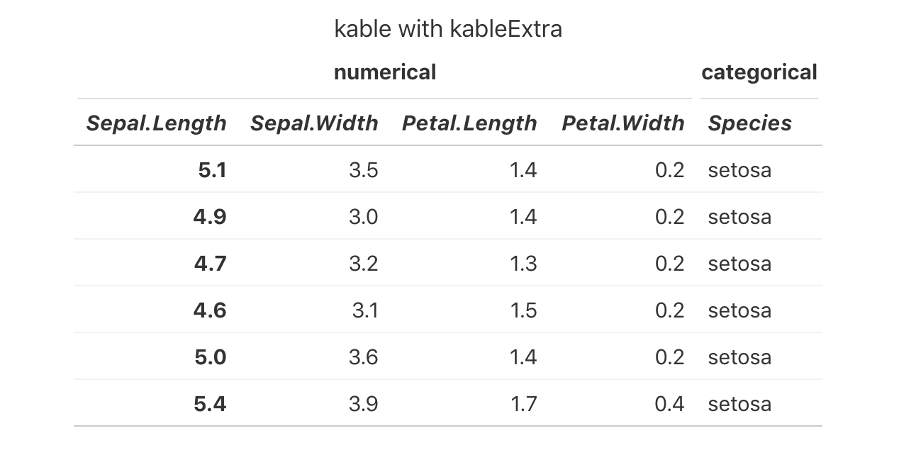

**Starting from kableExtra 1.1.0, you don't need to turn on this option as it's turned on by default for Radix and gitbook, for everyone's convenience. This Documentation is here to help you understand the logics behind the scene. **

**If you want to this kind of native support to other html format, please submit a PR and add the template name to [this line](https://github.com/haozhu233/kableExtra/blob/f3b6aa4bf1648979bbf48bb6f827755387eebed5/R/zzz.R#L23).**

People may find some features in `kableExtra`, such as hovering/striped rows are not working in `radix`. The reason is that `kableExtra` relies on `bootstrap` stylesheet to do these jobs while `radix` doesn't have those css load. Therefore you need to tell `kableExtra` to load the table css for you by setting `options(kableExtra.html.bsTable = T)`. 


```{r, echo = T}
library(kableExtra)
# options(kableExtra.html.bsTable = T)  # No need for version 1.1.0+

kable(iris[1:6, ], caption = "kable with kableExtra") %>%
  kable_styling(c("striped", "hover", "condensed"), full_width = F,
                position = "left") %>%
  add_header_above(c("numerical" = 4, "categorical" = 1)) %>%
  column_spec(1, bold = T) %>%
  row_spec(0, italic = T)
```


Comparing with other table options

```{r, echo = T}
kable(iris[1:6, ], caption = "Basic kable")
```

```{r, echo = T}
rmarkdown::paged_table(iris)
```

# Appendix
Here is a screenshot of how table looks like if you don't turn on the `kableExtra.html.bsTable` option (with the same code). In fact, the only part that breaks is the `striped` and `hover` option. :P


